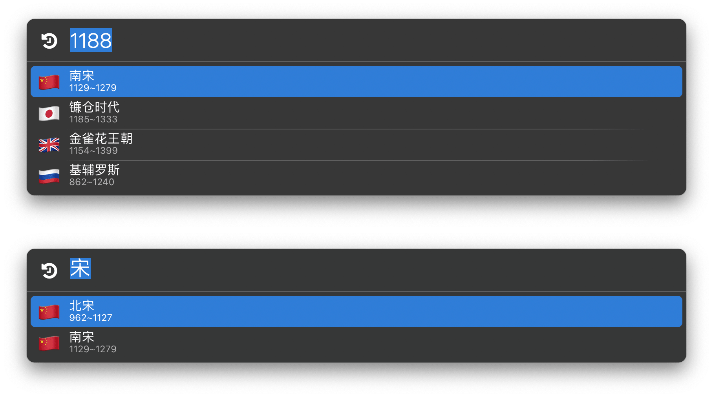

# Age Dic.lbaction

一个历史年表&重大事件查询工具，可输入年份或关键词进行查询。

示例动作仅包含中、日、英、俄四国主要历史时期，可以通过以下格式添加更多数据，年份为公元前时需采用例如 `-221 as integer` 的格式：

```
{n:"时期/事件", s:起始年份, e:终止年份, icon:"自己挑一个喜欢的国旗，可留空"},
```

国旗 Emoji 仅用作地理性质的粗略区分，并不表示该历史时期的政权，毕竟你也不可能找到“古罗马”的 Emoji，对不对？

