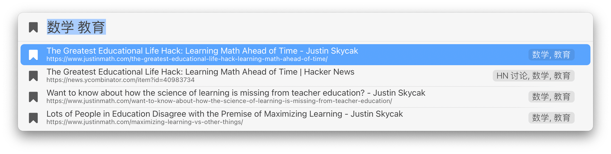

# Article Library

20240722 更新：优化代码逻辑，新增 label 功能以显示文章注释（标签），Credt [@Apus](https://utgd.net/author/10132)。

本套动作用于搭建本地文章数据库，可收集、检索和以 Markdown 格式调用文章。

需创建文本文件用于储存数据，为照顾跨平台使用，默认位置为 iCloud 的 Shortcut 文件夹。

如有条件，添加书签的步骤更推荐 [Keyboard Maestro 版](https://github.com/BlackwinMin/Keyboard-Maestro-gallery/tree/master/Article%20Library)。

