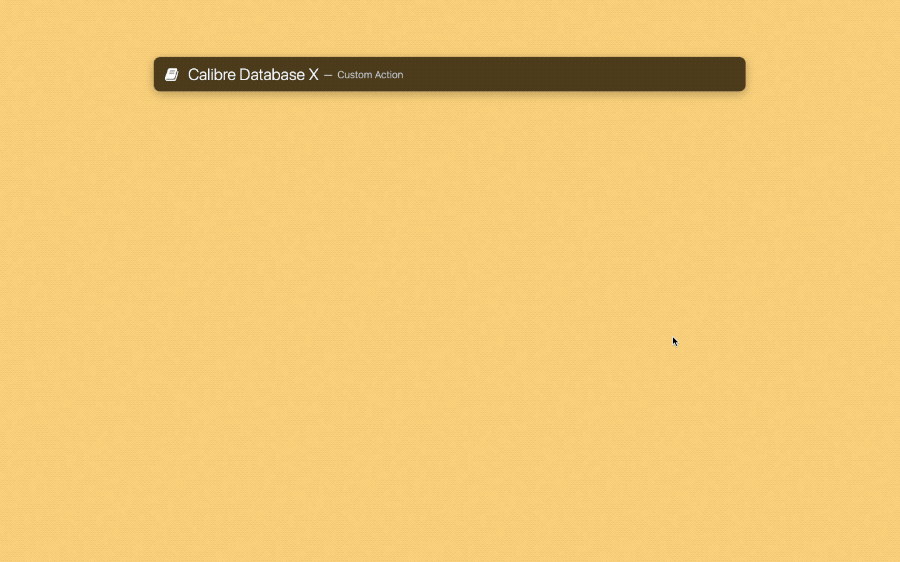

# Calibre Search

一套基于 LaunchBar 的 Calibre 书库查询系统，可在任何界面中搜索书籍，免去频频开启 Calibre 软件之苦：

1. 如果书籍在 Calibre 库中，则直接使用 Calibre 内置阅读器中打开；
2. 若是在 DEVONthink 中，则使用 DEVONthink 阅读书籍；
3. 如果在外部文件夹，则用默认阅读器打开（可自行修改）；
4. 在线书城中的图书，直接打开对应页面。

相关文章：

- [《巴别图书馆计划（一）：为什么，以及如何用 Calibre 统一管理书籍》](https://utgd.net/article/20253)
- [《巴别图书馆计划（二）：批量索引 DEVONthink 书籍到 Calibre》](https://utgd.net/article/20254)
- [《巴别图书馆计划（三）：批量索引任意书籍到 Calibre》](https://utgd.net/article/20255)
- 《Calibre 巴别图书馆计划（四）：用 LaunchBar 检索并打开书籍》（预计2023年11月发布）

处理 Calibre 数据库的工作，Credit [涔E](https://github.com/mpco/AlfredWorkflow-Calibre-Search)。