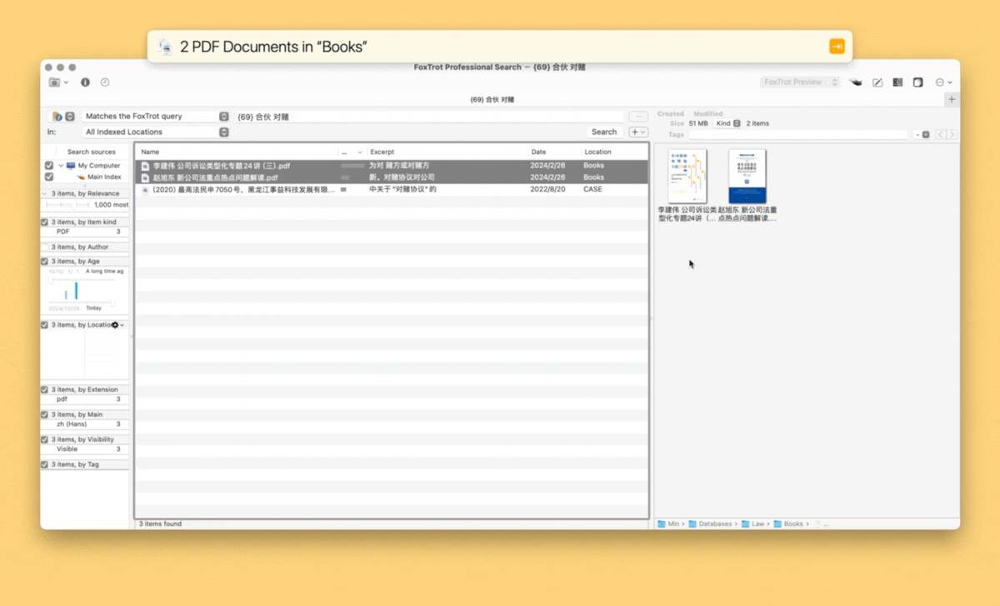

# FoxTrot Search Multi Files

在 FoxTrot 中搜索选定的复数个文件，突破默认情况下只能搜一个文件或整个文件夹的限制。当然，你需要事先索引过目标文件。

本动作在 Finder 中和 FoxTrot 搜索结果中均可使用。

出处：[FoxTrot 如何实现多文件搜索](https://utgd.net/article/21008/)。

另有 [Keyboard Maestro 版](https://github.com/BlackwinMin/Keyboard-Maestro-gallery/tree/master/FoxTrot%20Search%20Multi%20Files)。

