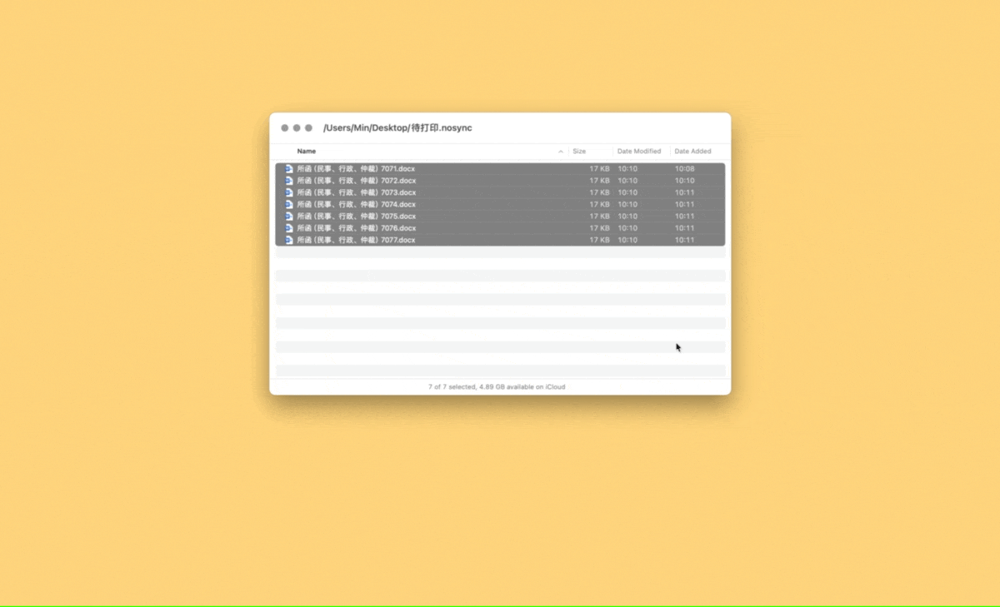

# Microsoft Word Merge 合并文档

合并当前选中的多个 Word 文档，以便打印。

附通用脚本，直接丢到 Keyboard Maestro、Shortcuts 或其他可以跑 AppleScript 的自动化工具中即可，无需顾及 I/O。区别在于，专用版本针对当前输入的文件而非在 Finder 	当前窗口中选中的文件，以免 Finder 窗口乱跳导致文件命中错误（该死的 Auto switch 特性和更该死的、关都关不了的 Bring all to front 特性）。在意交互细节的读者可参照 LaunchBar 版本代码修改通用脚本。

Microsoft Word for Windows 有批量插入功能，不必多此一举，惜乎 Microsoft Word for Mac 在过去十几年时间里随机取消或恢复批量选取功能，只能自食其力，无法仰仗官方。

出处：[《批量合并多个 Word 文档，以便打印（macOS）》](https://utgd.net/article/21204/)。

