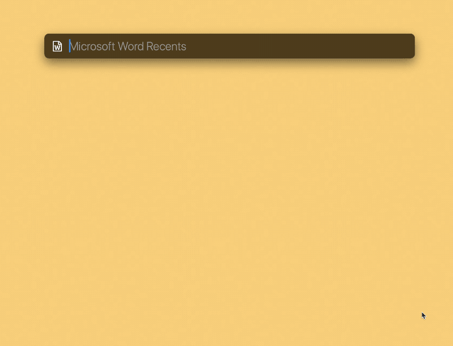

# Microsoft Word Recents 搜索 Word 最近文件

配合后台自动运行的 Keyboard Maestro 动作，解决 LaunchBar 不能显示 Word 最近文件的问题。支持中文搜索（限标题）。

本方案提出时间较早，如今在 Keyboard Maestro 11 中，可用自带 Token 抓取 Office 所打开文件的路径，预计全套 Office 软件均可使用本文方案。不过，由于我的工作几乎不涉及 Excel 和 PowerPoint，我暂时没有任何动力去研究，有兴趣的读者可以自行尝试。

出处：《用 LaunchBar 搜索 Word 的最近文件》，预计2024年2月底发布。

