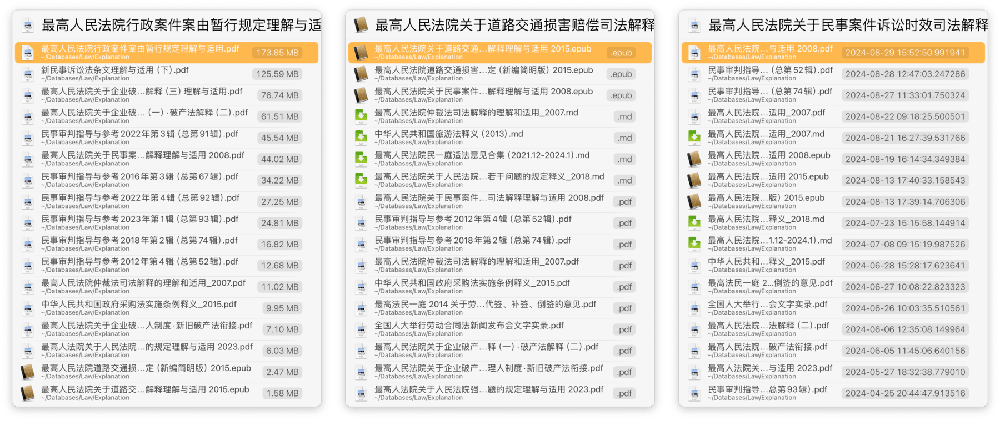

# Resort by… 重新排序文件

LaunchBar 在导航（浏览）文件时只能根据字母顺序排序，在中文环境中并不方便，何况我们也常常需要其他排序维度。本方案可按照文件拓展名、文件大小或修改日期重新排序 LaunchBar 当前所浏览的文件，并可配合 Keyboard Maestro 一键完成操作。

注：按修改日期排序的动作偶尔会报错，但不影响我使用，故暂无动力修复（20240919）。

出处：[在 LaunchBar 中浏览文件时自定义重新排序](https://utgd.net/article/21078/)。

