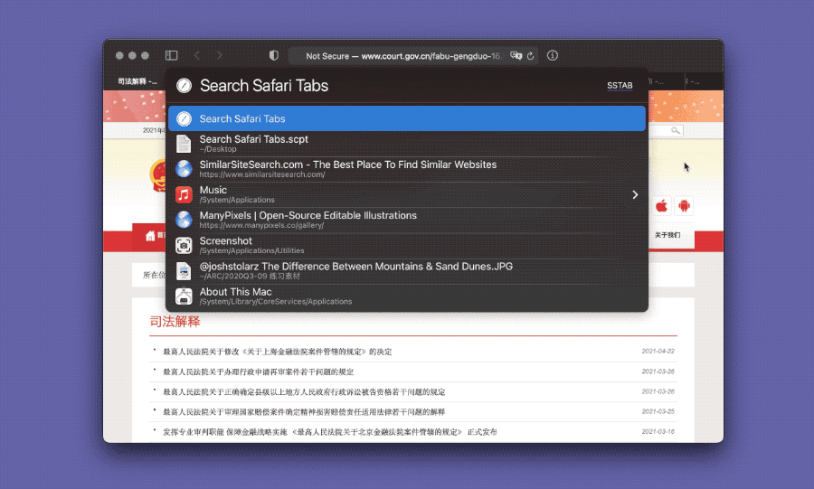

# Safari Tab Search

全文搜索当前的 Safari 标签页。此处的全文包括网页标题、链接和和正文。AppleScript 脚本可以移植到其他自动化工具中。

出处：[3-4 标签页的一般搜索及全文搜索（Safari） - 直达鹄的：在线搜索指津 | #UNTAG](https://utgd.net/course/20715/lesson/20726)

20240604更新：在最近几个大版本的 macOS 中，AppleScript 编写的 LaunchBar 动作无法 Live Feedback，故 [Apus](https://github.com/ApusYe) 制作了基于 Python 的版本（需配合 [JSON Helper](https://apps.apple.com/cn/app/json-helper-for-applescript/id453114608?l=en-GB&mt=12) 使用），更为流畅，特此感谢。源代码见 default_apus.py。

