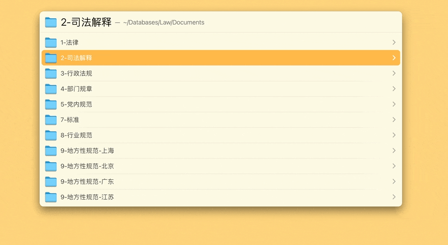

# Seach in Current Folder 中文搜索当前文件夹

解决“LaunchBar 不支持中文”的顽疾。本动作需配合 Keyboard Maestro 使用，单独使用没有意义。纯 LaunchBar 不是不行，但不能用快捷键，效率不高（把 Keyboard Maestro Macro 用 AppleScript 翻译一遍就能当 LaunchBar 动作用，但不推荐）。

使用方式：在 LaunchBar 中导航到任何一个文件夹，双击 `⌘Command-F`，即可搜索该文件夹，支持任意语种。本 LaunchBar 动作基于 `find` 命令，仅搜索文件名而不搜索文件内容，因为我不相信 Spotlight 索引，你愿意的话可以用 `mdfind` 命令魔改一下。

注意：使用前需在 Keyboard Maestro Macro 编辑器中手动启动 Macro，且因为涉及 USB Device Key Trigger，可能需要重新录制一下 `F` 键。

看不懂上面的话？等文章吧！预计2024年春节前发布。

顺予指出，“LaunchBar 不支持中文”的说法本就以偏概全。LaunchBar 有导航和搜索两种模式，只是官方并未提供搜索文件夹的动作，需自行编写。

