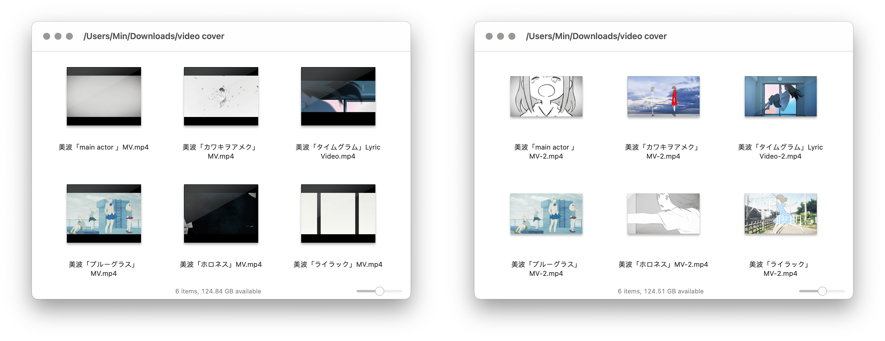

# Video Add Cover 为视频文件添加封面

借助 FFmpeg，选中视频文件和图片素材，即可将图片添加为视频文件的封面。

出处：[《如何为视频快速添加封面（附 Shortcuts 及其他动作下载）》](https://utgd.net)（发布时间未定）。

另有 [Shortcuts 版](https://github.com/BlackwinMin/Shortcuts-Actions-gallery/tree/master/Video%20Add%20Cover)。

